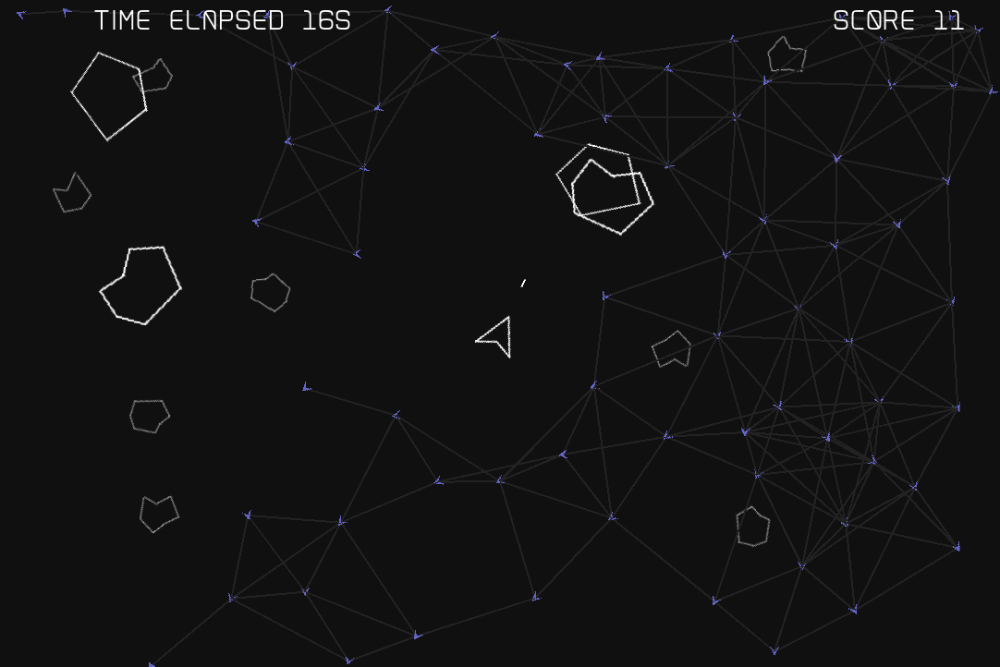
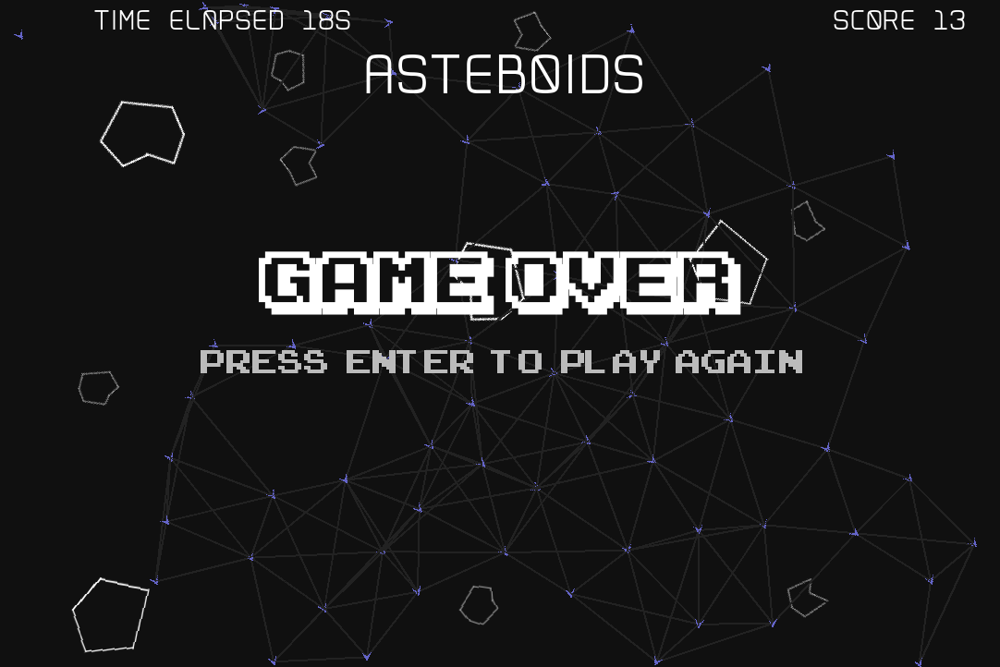

<h1 align="center">Welcome to asteboids 👋</h1>
<p>
  
  <a href="https://github.com/jtbonhomme/asteboids#readme" target="_blank">
    
  </a>
  <a href="https://github.com/jtbonhomme/asteboids/graphs/commit-activity" target="_blank">
    
  </a>
  <a href="https://github.com/jtbonhomme/asteboids/blob/master/LICENSE" target="_blank">
    
  </a>
  <a href="https://godoc.org/github.com/jtbonhomme/asteboids" target="_blank">
    
  </a>
  <a href="https://github.com/jtbonhomme/asteboids/blob/master/coverage_badge.png" target="_blank">
    
  </a>
</p>

> This repository is a simple port of the original Atari 1979's game in Go, with boids (autonomous agents).

### 🏠 [Homepage](https://github.com/jtbonhomme/asteboids#readme)




### A little bit of history

[Asteroids](https://en.wikipedia.org/wiki/Asteroids_(video_game)) is a arcade game released in 1979 by [Atari, Inc](https://en.wikipedia.org/wiki/Atari,_Inc.). The player controls a single spaceship in an asteroid field. The object of the game is to shoot and destroy the asteroids, while not colliding with either. The game becomes harder as the number of asteroids increases.


This repository is a simple port of the original game play in Go, while replacing asteroids with boids (autonomous agents).

### ✨ [Demo](https://jtbonhomme.github.io/asteboids)

## Build

```sh
$ make build
```

Will create an `asteboids` binary executable file.

## Run

```sh
$ make run
```

## Run with debug information

```sh
$ make debug
```


## Run in a browser with Web Assembly

```sh
$ make wasm
```

**⚠** This feature is **broken** since integration with `segmentio/conf` **⚠** (see: [#14](https://github.com/jtbonhomme/asteboids/issues/14))

## Keyboard control

* `key up`: startship move forward
* `key left`: startship rotate counter clockwise
* `key right`: startship rotate clockwise
* `space`: startship shot
* `enter`: game restart
* `s`: takes a screenshot (file is stored as `screenshot_<date><time>.png`)
* `cmd+q`: exit


## Options

By default, `Asteboids` will read from a configurable file defined by the `-config-file` command line argument, then load values present in the environment, and finally load the program arguments.

### CLI

Passing configuration via the program arguments:

```sh
$ go run cmd/asteboids/main.go -debug
```

### Environment variables

Passing configuration via the environment variables:

```sh
$ ASTEBOIDS_BOIDS=100 go run cmd/asteboids/main.go
```

### Configuration File

Passing configuration via a configuration file:

```sh
$ go run cmd/asteboids/main.go -config-file ./custom_config.yml
```

Default configuration is located in the file [config.yml](config.yml)

### Option List


## Flocking

In his book [Nature Of Code](https://www.amazon.fr/Nature-Code-Simulating-Natural-Processing/dp/0985930802), Daniel Shiffman reminds us the three rules of flocking:


1. Separation (also known as “avoidance”): Steer to avoid colliding with your neighbors.
2. Alignment (also known as “copy”): Steer in the same direction as your neighbors.
3. Cohesion (also known as “center”): Steer towards the center of your neighbors (stay
with the group).

The boids in Asteboids implement these 3 rules.

## Resources

### Fonts

Some fonts in this repository are copyright (c) Jakob Fischer at www.pizzadude.dk,  all rights reserved. 
Do not distribute without the author's permission.
Use these font for non-commercial use only! If you plan to use them for commercial purposes, contact the author before doing so!
For more original fonts take a look at www.pizzadude.dk

## Author

👤 **jtbonhomme@gmail.com**

* Website: http://jtbonhomme.github.io
* Twitter: [@jtbonhomme](https://twitter.com/jtbonhomme)
* Github: [@jtbonhomme](https://github.com/jtbonhomme)
* LinkedIn: [@jtbonhomme](https://linkedin.com/in/jtbonhomme)

## 🤝 Contributing

Contributions, issues and feature requests are welcome!<br />Feel free to check [issues page](https://github.com/jtbonhomme/asteboids/issues). You can also take a look at the [contributing guide](https://github.com/jtbonhomme/asteboids/blob/master/CONTRIBUTING.md).

## Show your support

Give a ⭐️ if this project helped you!

## 📝 License

Copyright © 2021 [jtbonhomme@gmail.com](https://github.com/jtbonhomme).<br />
This project is [MIT](https://github.com/jtbonhomme/asteboids/blob/master/LICENSE) licensed.

***
_This README was generated with ❤️ by [readme-md-generator](https://github.com/kefranabg/readme-md-generator)_